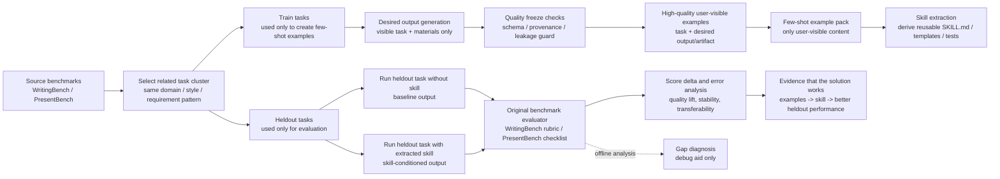

# Benchmark Flow

Core claim:

> If users can only provide a few good examples, the system should infer a reusable skill from those examples and improve performance on new tasks judged by the original benchmark rubrics.

## What This Proves

- The examples are constructed by us from benchmark tasks and visible materials.
- The generated few-shot examples simulate what a user can provide: task inputs, desired outputs/artifacts, materials, and optional user notes, not manually written skills.
- Rubrics, teacher critiques, and score traces are benchmark construction or evaluation machinery. They should be stripped before the auto-skill module sees the examples unless a named baseline explicitly exposes them.
- The extracted skill is evaluated on heldout tasks from the same benchmark distribution.
- The proof is not "we can recognize a reusable gap"; the proof is "examples can induce a reusable skill that improves benchmark-scored outputs."

## Minimal Experimental Unit

For each task cluster:

1. Sample `k` train tasks and `n` heldout tasks.
2. Use train tasks to generate solved few-shot examples; keep only user-visible content for induction.
3. Extract one transferable skill module from those examples.
4. Run heldout tasks with and without the extracted skill.
5. Compare rubric/checklist scores and inspect failure modes.
